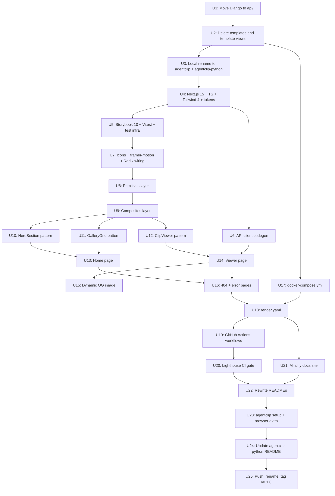

# AgentClip monorepo pivot and Next.js perfection-bar UI

## Overview

Restructure AgentClip from "Django repo with templated UI plus a separate Python package" to "monorepo with `api/` (Django) and `web/` (Next.js) plus the renamed Python package." Replace Django templates entirely. Ship a Next.js 15 + Tailwind 4 + Storybook 10 frontend with ~19 components across three tiers, dynamic per-clip OG images, type-safe API client generated from the DRF OpenAPI schema, Mintlify-hosted docs at `docs.agentclip.dev`, Render as the canonical deploy target via `render.yaml`. License stays MIT.

Two repos at the end:

- `ericelizes/agentclip` — the platform monorepo (`api/` + `web/`)
- `ericelizes/agentclip-python` — the Python client (renamed from current `agentclip`)

## Problem Frame

The current Django-templated UI clears a working bar but not the 2026 OSS dev-tool aesthetic recruiters at design-conscious AI companies pattern-match as taste-aligned (Linear, Cursor, Modal, Vercel). AgentClip is a portfolio piece for Eric's job search; the public surfaces (`agentclip.dev` and `docs.agentclip.dev`) need to read as polished as Cal.com / Plane / Langfuse. This is also the right architectural moment, pre-launch and pre-production-data, before any restructuring becomes expensive.

(see origin: `docs/brainstorms/2026-05-05-agentclip-pivot-requirements.md`)

## Requirements Trace

- **R1.** Two repos under personal profile, named per the canonical 2026 pattern (`agentclip` for the platform, `agentclip-python` for the SDK).
- **R2.** Platform monorepo with `api/` (Django + DRF) and `web/` (Next.js 15) cleanly separated, sharing the same git history, deploy spec, and contributor onboarding (`docker compose up`).
- **R3.** Django templates entirely deleted; Next.js is the only UI surface.
- **R4.** Web frontend ships with Next.js 15 + React 19 + TypeScript 5 + Tailwind 4 + Storybook 10 + Vitest + Radix primitives + lucide-react + simple-icons + framer-motion. Stack matches the `manifest` reference repo so visual taste carries.
- **R5.** ~19 components across three tiers (`primitives`, `composites`, `patterns`), each with a co-located `.stories.tsx` and Storybook play interactions where applicable. ESLint enforces import-direction rules between tiers.
- **R6.** Two pages: `/` (home with hero + how-it-works + curated gallery) and `/s/[token]` (server-rendered viewer with credit attribution and slide list). Plus 404 + error pages.
- **R7.** Per-clip dynamic OG image generation via Next.js `opengraph-image.tsx`. Card includes wordmark, title, first-slide preview, and creator credit.
- **R8.** Type-safe API client generated from DRF OpenAPI schema (drf-spectacular → openapi-typescript). Backend and frontend types stay in sync automatically.
- **R9.** Lighthouse CI gate: a11y ≥ 95 hard fail; performance ≥ 90, best practices ≥ 95, SEO ≥ 95 warn-only at v0.1.
- **R10.** `render.yaml` at repo root ships infra-as-code for both services + Postgres. `.do/app.yaml` retained as alternative deploy. `docker-compose.yml` for local dev. Multiple deploy paths for self-hosters.
- **R11.** Mintlify-hosted docs at `docs.agentclip.dev` with at least five sections (quickstart, MCP setup, CLI reference, self-hosting, troubleshooting). Deployed separately, free OSS tier.
- **R12.** MIT license preserved on both repos. Documented choice in CONTRIBUTING.md so the rationale is explicit.
- **R13.** Each implementation unit lands as one focused, well-justified atomic commit. Conventional prefix (feat / fix / refactor / chore / docs). Body explains *why*, not just *what*. The cumulative log on each repo reads as a textbook portfolio engineering progression.

## Scope Boundaries

- **No JS SDK** at v0.1. `agentclip-js` is deferred to v0.2 once the Python wire shape has been battle-tested.
- **No accounts / login system.** v1 stays accountless; the `write_token` is the only credential.
- **No browser harness.** AgentClip is the upload layer; agents bring their own browser tools.
- **No real-time client-side state.** No live updates, no websockets, no slide-reorder UI.
- **No Terraform** at v0.1. `render.yaml` is sufficient IaC. Defer to v0.2 if cross-cloud needs emerge.
- **No public delete endpoint.** Django admin is the operator surface for v0.1.
- **No localization.** Strings route through a `t()` helper for future i18n readiness, but only English ships.
- **No server-side video thumbnail extraction.** OG cards for video-only clips fall back to the AgentClip default card.
- **No form primitives, navigation primitives, advanced motion components, or error states in the design system at v0.1.** Add when an actual page needs them.

### Deferred to Separate Tasks

- **Production deploy to Render and DNS configuration**: Eric runs the operational steps after this plan's code work lands. Captured as Unit 25 (operational, his hands).
- **Repo renames on GitHub**: happens at push time alongside `gh repo create`. Captured as Unit 25.
- **PyPI v0.1.0 publish via OIDC trusted publisher**: triggered by tagging `v0.1.0` on `agentclip-python`. Captured as Unit 25.
- **awesome-mcp-servers PR**: post-PyPI launch task; not part of this plan.
- **Generating the README hero asset**: depends on the live deployed `agentclip.dev` rendering real seeded clips. Captured as part of Unit 25's operational ritual.

## Context & Research

### Relevant Code and Patterns

- **`manifest`** (Eric's other Next.js project) — canonical reference for component tiers, Tailwind 4 setup, Storybook 10 wiring, Radix primitive usage, lucide icons, the package.json shape, and the AGENTS.md/CLAUDE.md conventions. Per its CLAUDE.md: "Storybook required for all new UI components — add `.stories.tsx` alongside the component", "Three-tier component structure: `primitives/`, `composites/`, `patterns/`", "Functional React components only", "CSS via Tailwind or globals.css".
- **`agentclip-app/slideshows/`** — current Django app with models, serializers, views, admin, tests. The `slideshows.urls` module's split between `/api/...` routes and `/`/`/s/<token>/` routes is what changes (the latter two go away).
- **`agentclip-app/templates/base.html`** + **`slideshows/templates/slideshows/{home,viewer}.html`** — Django templates being deleted. Useful only as a reference for what the Next.js pages must render; the visual design itself stays close to what's there now (Geist Sans, vermillion accent, mobile-first), just rebuilt in React.
- **`agentclip/src/agentclip/`** — Python SDK; this plan does not change its code, only its repo name.
- **`agentclip-app/.do/app.yaml`** — current DigitalOcean App Platform spec; retained as an alternative deploy path, paths get updated to point under `api/`.
- **`agentclip-app/docs/plans/2026-05-05-001-feat-agentclip-launch-arc-plan.md`** — prior plan covering the SDK + DO-deploy launch arc. Most of the SDK side (whoami, attribution, video clips) is already shipped. The pre-pivot deploy unit (U4 in that plan) is superseded by Unit 18 in this one.

### Institutional Learnings

- **Conventional commit hygiene is load-bearing.** This session has shipped 35+ atomic commits across both repos with conventional prefixes and body explanations. The new commits in this arc must match that bar.
- **Em dashes are forbidden in user-facing copy** (commit messages, READMEs, error messages, in-app strings). Sweep every commit for `—` before staging.
- **No model or vendor names** in marketing copy ("Claude", "GPT", etc.). Skill ships for any agent runtime.
- **Migrations regenerated cleanly when schema changes pre-launch.** No production data exists, so a single coherent initial migration is the right end state. Once Render is live, future migrations append.

### External References

- **Next.js 15 App Router patterns**: official docs on Server Components, generateMetadata, opengraph-image conventions.
- **Tailwind CSS 4 token system**: CSS-first `@theme` blocks (the new idiom; supersedes `theme.extend` in `tailwind.config.ts` for v3).
- **Radix UI primitives**: same as `manifest`, especially for Tooltip, Dialog, Tabs, Avatar.
- **drf-spectacular** for DRF OpenAPI generation; **openapi-typescript** for client-side type generation.
- **Render Blueprints (`render.yaml`)**: official spec.
- **Mintlify docs setup**: official quickstart, free-for-OSS tier.
- **shadcn/ui patterns**: not a dependency, but the cva + tailwind-merge + Radix primitive combo we ship is the shadcn "ethos."

## Key Technical Decisions

- **CSS-first Tailwind 4 tokens via `@theme` blocks**: matches the v4 idiom; the `tokens.ts` file becomes the single source consumed by both Tailwind (via PostCSS) and Storybook (via direct import). `manifest` uses this same approach.
- **Type-safe API client codegen, not hand-curated**: `drf-spectacular` generates OpenAPI from the existing serializers; `openapi-typescript` produces TS types at build time. Wire-shape changes cannot drift between the Django and Next.js sides without breaking CI. (see origin: deferred-to-planning resolution)
- **Component tier import-direction enforced via ESLint**, not by trust: `eslint-plugin-import` no-restricted-paths rule. `patterns/` can import `composites/` and `primitives/`; `composites/` can import `primitives/`; nothing imports the reverse. Architectural drift becomes a lint error.
- **Server Components by default in App Router**: pages are server-rendered for share-card scrapers and OG meta. Interactive bits (video play tracking, expand-to-fullscreen, Tabs) opt into `'use client'` explicitly.
- **opengraph-image.tsx with satori**: Next.js's built-in OG generation runs on the Edge runtime. On Render's Node runtime, it runs slightly slower (~50-200ms) but works identically. Acceptable cost.
- **Renames at push time, not before**: local directory names match GitHub repo names but the rename itself is cheap; sequencing it at push time keeps mid-flight branch tooling simpler.
- **Mintlify deployed separately at `docs.agentclip.dev`**: not part of the monorepo. Their CLI seeds an MDX project; we host config in `docs.agentclip.dev`'s own Mintlify project. Single-repo monorepo with docs as a third app would over-couple the deploy story.
- **`render.yaml` as committed IaC**: Render-native, declarative. Self-hosters can use it directly or fall back to `.do/app.yaml` or generic Docker.
- **Each implementation unit corresponds to one atomic commit**: this is a hard constraint per the brainstorm. Splitting bigger units into multiple commits is allowed if implementation reveals complexity; merging smaller units into one is not.

## Open Questions

### Resolved During Planning

- **Tailwind 4 token-consumption pattern**: CSS-first `@theme`. Resolved.
- **API client codegen vs hand-curated**: codegen via drf-spectacular + openapi-typescript. Resolved.
- **Component naming for compound primitives**: dot-notation (`Tabs.Root`, `Tabs.List`) for Radix-wrapping multi-part primitives; flat for single-part. Resolved.
- **Repo rename ordering**: local first (free), GitHub at push time. Resolved.

### Deferred to Implementation

- **`next/font/google` configuration for Geist + Geist Mono**: weight subset, fallback, preload behavior. Settle when wiring layout.tsx.
- **Satori font subset for OG image generation**: which Geist subset gets embedded; cold-start payload size. Settle when implementing opengraph-image.tsx.
- **Skeleton component animation timing and palette**: settle when designing the Skeleton primitive.
- **Vitest coverage thresholds**: settle when wiring Vitest config; default to 70% line coverage on the `lib/` and `components/primitives/` directories.
- **Storybook addon-a11y CI severity threshold**: error vs warning per rule. Settle during CI integration.
- **Specific Mintlify nav structure**: settle while writing the docs sections in Unit 21.
- **Whether `next/image` is used for slide thumbnails**: vs raw ``, depending on whether DO Spaces serves images compatibly with Next.js Image's loader. Settle when implementing ClipCard / MediaFrame.
- **Whether the `web/` ESLint config extends from a shared `manifest`-style config or stays standalone**: settle when wiring ESLint.
- **Per-route revalidate intervals**: home is mostly static; viewer needs server-rendering on every request for fresh data. Settle when implementing the routes.

## Output Structure

```
agentclip/                                            (renamed from agentclip-app)
├── api/                                              (NEW: Django moved here)
│   ├── slideshows/                                   (moved)
│   ├── agentclip_app/                                (moved; settings, urls, wsgi)
│   ├── manage.py                                     (moved)
│   ├── Dockerfile                                    (moved; paths updated)
│   ├── requirements.txt                              (moved)
│   ├── .env.example                                  (moved)
│   └── ...
├── web/                                              (NEW: Next.js 15)
│   ├── app/
│   │   ├── (home)/page.tsx                           (home; assembled from patterns)
│   │   ├── s/[token]/page.tsx                        (viewer; SSR data fetch)
│   │   ├── s/[token]/opengraph-image.tsx             (dynamic OG card per clip)
│   │   ├── layout.tsx                                (root + Geist fonts + theme)
│   │   ├── not-found.tsx
│   │   ├── error.tsx
│   │   └── globals.css                               (@theme blocks; Tailwind 4 tokens)
│   ├── components/
│   │   ├── primitives/
│   │   │   ├── Button/{Button.tsx, Button.stories.tsx}
│   │   │   ├── Pill/{Pill.tsx, Pill.stories.tsx}
│   │   │   ├── Badge/{Badge.tsx, Badge.stories.tsx}
│   │   │   ├── Card/{Card.tsx, Card.stories.tsx}
│   │   │   ├── Code/{Code.tsx, Code.stories.tsx}
│   │   │   ├── Tooltip/                              (Radix-wrapped)
│   │   │   ├── Dialog/                               (Radix-wrapped)
│   │   │   ├── Avatar/                               (Radix-wrapped)
│   │   │   ├── Tabs/                                 (Radix-wrapped, dot-notation)
│   │   │   └── Skeleton/
│   │   ├── composites/
│   │   │   ├── ClipCard/                             (gallery item)
│   │   │   ├── MediaFrame/                           (image vs video render)
│   │   │   ├── SummaryCallout/                       (vermillion left-rule card)
│   │   │   ├── MetaRow/                              (label dots + Filed-by credit)
│   │   │   ├── CodeBlock/                            (install snippet)
│   │   │   └── NavBar/                               (sticky brand + GitHub button)
│   │   └── patterns/
│   │       ├── HeroSection/                          (home hero)
│   │       ├── GalleryGrid/                          (clip-card grid)
│   │       └── ClipViewer/                           (full clip page assembly)
│   ├── lib/
│   │   ├── api.ts                                    (typed client; uses generated types)
│   │   ├── api-types.ts                              (generated from DRF OpenAPI; gitignored or committed)
│   │   ├── tokens.ts                                 (single-source design tokens)
│   │   └── utils.ts                                  (cn() helper for tailwind-merge + cva)
│   ├── .storybook/
│   │   ├── main.ts                                   (addons: a11y, docs, test-runner)
│   │   └── preview.tsx                               (theme decorator, font loader)
│   ├── tests/                                        (or co-located *.test.tsx; settle in implementation)
│   ├── package.json
│   ├── tsconfig.json                                 (strict + noUncheckedIndexedAccess + exactOptionalPropertyTypes)
│   ├── next.config.ts
│   ├── eslint.config.mjs                             (typescript-eslint strict + jsx-a11y + import-direction)
│   ├── prettier.config.cjs
│   ├── postcss.config.mjs                            (Tailwind 4)
│   ├── vitest.config.ts
│   └── README.md                                     (web-specific)
├── docs/                                             (already exists; plans + brainstorms)
├── docker-compose.yml                                (NEW: api + web + postgres for local dev)
├── render.yaml                                       (NEW: Render IaC)
├── .do/app.yaml                                      (retained as alternative deploy path)
├── .github/workflows/
│   ├── api-ci.yml                                    (Django check + ruff + pytest + Docker build)
│   └── web-ci.yml                                    (eslint + tsc + vitest + storybook + Lighthouse)
├── README.md                                         (platform-level; rewritten)
├── CHANGELOG.md
├── CONTRIBUTING.md                                   (rewritten; covers both api and web workflows)
├── CODE_OF_CONDUCT.md
├── SECURITY.md
└── LICENSE                                           (MIT, unchanged)

agentclip-python/                                     (renamed from agentclip)
├── src/agentclip/                                    (unchanged Python source)
├── tests/                                            (unchanged)
├── pyproject.toml                                    (unchanged: publishes 'agentclip' to PyPI)
├── README.md                                         (rewritten: cross-link to ericelizes/agentclip)
├── server.json                                       (unchanged MCP registry manifest)
└── ...                                               (existing OSS hygiene files retained)
```

## High-Level Technical Design

> *This illustrates the intended approach and is directional guidance for review, not implementation specification. The implementing agent should treat it as context, not code to reproduce.*

### Dependency graph for implementation units



### Data flow for the viewer page

```
Browser request: GET https://agentclip.dev/s/abc123

  Next.js Server Component (web/app/s/[token]/page.tsx)
    └─> fetch (server-side, no client roundtrip):
          GET https://api.agentclip.dev/api/slideshow/?share_token=abc123
            └─> Django DRF endpoint
                  └─> SlideshowPublicSerializer
                        ├─> Slideshow row + prefetched slides
                        ├─> media_url (absolute, points at DO Spaces)
                        └─> created_by + created_by_url
            <─ JSON
    <─ Slideshow data
    └─> Renders <ClipViewer slideshow={data} /> (server component tree)
          ├─> NavBar
          ├─> HeroSection (title, description, MetaRow with credit)
          ├─> SummaryCallout (if summary present)
          └─> for each slide:
                <MediaFrame slide={...} />
                  └─> branches on slide.media_kind:
                        ├─> 'image' → 
                        └─> 'video' → <video controls preload="metadata"> ('use client')

  Browser receives complete HTML with og:image meta pointing at:
    https://agentclip.dev/s/abc123/opengraph-image
        └─> Next.js generates OG card on the fly via satori
              ├─> wordmark + vermillion bullet
              ├─> clip title (Geist Sans, large)
              ├─> first slide preview thumb (vermillion border)
              └─> "Filed by [name] · N clips" attribution row
        <─ image/png response (1200x630)

  Slack/Twitter/LinkedIn scraper:
    fetches /s/abc123 → parses og:image URL → fetches OG card → displays preview
```

## Implementation Units

### Phase A: Restructure (3 units)

- [ ] **Unit 1: Move Django app to `api/` subdirectory**

**Goal:** Move the existing Django code under `api/` to make room for `web/` alongside it.

**Requirements:** R2.

**Dependencies:** None.

**Files:**
- Move (git mv): `agentclip_app/` → `api/agentclip_app/`
- Move: `slideshows/` → `api/slideshows/`
- Move: `manage.py` → `api/manage.py`
- Move: `Dockerfile` → `api/Dockerfile`
- Move: `requirements.txt` → `api/requirements.txt`
- Move: `.env.example` → `api/.env.example`
- Move: `db.sqlite3.bak` → not moved; gitignored already
- Modify: `.do/app.yaml` (paths updated to point at `api/Dockerfile`, working directory etc.)
- Modify: `Dockerfile` references inside `.do/app.yaml`

**Approach:**
- `git mv` everything Django-related under `api/`. History preserves cleanly.
- Update `.do/app.yaml`'s `dockerfile_path` and `source_dir` to point at `api/`.
- No source-code changes inside the Django app; this is purely a directory move.
- Verify after the move: `cd api && python manage.py check` passes.

**Patterns to follow:**
- `manifest`'s monorepo structure (apps and services live in subdirs, not at root).
- `Plane` and `Trigger.dev` both organize as `apiserver/` + `web/`.

**Test scenarios:**
- Test expectation: none — pure file move, no behavior change. Existing 34 Django tests must still pass after the move (run them as part of verification).

**Verification:**
- `cd api && DJANGO_DEBUG=true python manage.py check` exits 0.
- `cd api && DJANGO_DEBUG=true python manage.py test slideshows` passes 34 tests.
- `git log --follow api/slideshows/models.py` shows full history (rename detection works).

---

- [ ] **Unit 2: Delete Django templates and template-rendering views**

**Goal:** Remove the home and viewer Django views and their templates. Next.js takes over those URLs.

**Requirements:** R3.

**Dependencies:** Unit 1.

**Files:**
- Delete: `templates/base.html` (the top-level shared template)
- Delete: `api/slideshows/templates/` (entire directory)
- Modify: `api/slideshows/views.py` (remove `slideshow_viewer` and `home` view functions; keep all DRF endpoints; remove the now-unused `_GALLERY_TOKENS` constant and `home` query for it)
- Modify: `api/slideshows/urls.py` (remove the `s/<share_token>/` and empty `''` routes; keep all `api/...` routes)
- Modify: `api/agentclip_app/urls.py` (drop the `static()` block for media in DEBUG since web serves images directly from Spaces; verify CSRF middleware stays because admin still uses it)
- Modify: `api/slideshows/tests.py` (remove `PublicViewerTests` class; the viewer is no longer Django's responsibility)

**Approach:**
- Remove dead code in one focused commit so the diff reads as "Django steps back to API-only role."
- Keep DRF endpoints, models, admin, migrations, ratelimit, exception handler — all unchanged.
- The 4 viewer tests that get removed lose us coverage of "viewer renders correctly," but that coverage moves to web/'s integration test suite later (Unit 14).

**Patterns to follow:**
- Look at `Plane`'s history when they removed Django-templated UI in favor of Next.js — they kept DRF endpoints and admin, deleted template renderers.

**Test scenarios:**
- Happy path: 30 remaining tests in `api/slideshows/tests.py` still pass (the 4 viewer tests are removed, which is the change).
- Edge case: `DJANGO_DEBUG=true python manage.py check` reports no errors after the route deletions.
- Edge case: `curl http://localhost:8000/api/slideshow/` still returns valid responses; the API surface is unchanged.

**Verification:**
- `cd api && python manage.py test slideshows` shows 30 passing (4 fewer than before).
- `cd api && python manage.py check` clean.
- `templates/` directory and `api/slideshows/templates/` directory both gone from the repo.

---

- [ ] **Unit 3: Local directory renames + README pointer updates**

**Goal:** Rename local working directories so they match the upcoming GitHub repo names. No remote-side changes yet.

**Requirements:** R1.

**Dependencies:** Unit 2 (so the api restructure has settled before the rename).

**Files:**
- Local rename only (not a git operation): `/home/eric/code/agentclip-app/` → `/home/eric/code/agentclip/`
- Local rename only: `/home/eric/code/agentclip/` → `/home/eric/code/agentclip-python/`
- Modify: `agentclip-python/README.md` (update self-references and cross-links to point at `ericelizes/agentclip` and `ericelizes/agentclip-python`)
- Modify: `agentclip/README.md` (update GitHub URL references)
- Modify: `agentclip/CONTRIBUTING.md`, `SECURITY.md`, `CODE_OF_CONDUCT.md` (any URL self-references)
- Modify: `agentclip-python/.github/workflows/release.yml` (PyPI environment URL stays `pypi.org/p/agentclip` — package name unchanged)
- Modify: `agentclip-python/server.json` (homepage and repository URLs point at the new names)
- Modify: `agentclip-python/pyproject.toml` (project URLs)
- Modify: `agentclip-python/CONTRIBUTING.md` (any URL self-references)

**Approach:**
- Local renames are filesystem moves; git history is unaffected.
- README copy needs the cross-link refresh: `agentclip-python` README points at `ericelizes/agentclip` (the platform). `agentclip` README points at `ericelizes/agentclip-python` (the SDK).
- Commit the README updates *as a separate commit per repo* — not bundled with the directory rename, since the rename itself doesn't show up in git.

**Patterns to follow:**
- Match the cross-link style from `Plane`'s README, which prominently links to `plane-python-sdk`.
- Match `Langfuse`'s README cross-references to `langfuse-python` and `langfuse-js`.

**Test scenarios:**
- Test expectation: none — pure copy and filesystem renames, no behavioral change.

**Verification:**
- `pwd` after `cd /home/eric/code/agentclip` works.
- `pwd` after `cd /home/eric/code/agentclip-python` works.
- `grep -r "agentclip-app" .` returns nothing in either repo.
- READMEs link to the right GitHub URLs (`github.com/ericelizes/agentclip` and `github.com/ericelizes/agentclip-python`).

### Phase B: Web bootstrap (4 units)

- [ ] **Unit 4: Bootstrap Next.js 15 + TypeScript + Tailwind 4 + tokens**

**Goal:** Stand up an empty `web/` skeleton that builds, type-checks, and serves a placeholder page.

**Requirements:** R2, R4.

**Dependencies:** Unit 3.

**Files:**
- Create: `web/package.json` (Next 15, React 19, TS 5, Tailwind 4, lucide-react, simple-icons, framer-motion, Radix UI primitives, cva, tailwind-merge — match `manifest`'s versions)
- Create: `web/tsconfig.json` (strict + `noUncheckedIndexedAccess` + `exactOptionalPropertyTypes` + `verbatimModuleSyntax` + path aliases for `@/components/*`, `@/lib/*`, `@/app/*`)
- Create: `web/next.config.ts`
- Create: `web/postcss.config.mjs` (Tailwind 4 via `@tailwindcss/postcss`)
- Create: `web/eslint.config.mjs` (typescript-eslint strict + jsx-a11y + import-direction rules between component tiers)
- Create: `web/prettier.config.cjs`
- Create: `web/app/layout.tsx` (root layout; loads Geist Sans + Geist Mono via `next/font/google`)
- Create: `web/app/(home)/page.tsx` (placeholder home page rendering "AgentClip" wordmark)
- Create: `web/app/globals.css` (Tailwind directives + `@theme` block consuming `tokens.ts` values)
- Create: `web/lib/tokens.ts` (single-source design tokens: vermillion `#d94824`, ink, paper, surface, border, radius scale, motion easings)
- Create: `web/lib/utils.ts` (`cn()` helper using cva + tailwind-merge)
- Create: `web/.gitignore` (Next.js standard)
- Create: `web/README.md` (web-specific dev instructions)

**Approach:**
- Use `pnpm create next-app@latest` as the seed, then strip its app/page.tsx and configs to match the `manifest`-style structure.
- ESLint config enforces import direction: `eslint-plugin-import` `no-restricted-paths` rule disallows `primitives/` from importing `composites/` or `patterns/`, and `composites/` from importing `patterns/`.
- Tokens live in `lib/tokens.ts` as plain TypeScript; consumed by `globals.css` via `@theme` blocks (CSS-first per Tailwind 4) and by Storybook stories via direct import.
- Match `manifest`'s package.json scripts (`dev`, `build`, `start`, `lint`, `type:check`, `format`).
- Skip everything Storybook / Vitest / Radix / icons-related; those land in subsequent units to keep this commit focused.

**Patterns to follow:**
- `manifest/package.json` — exact dependency versions and dev/build script names.
- `manifest/tsconfig.json` — strictness flags and path aliases.
- Tailwind 4 official docs — CSS-first `@theme` syntax for tokens.

**Test scenarios:**
- Test expectation: none — pure scaffolding; behavior is "the placeholder page renders." The next unit (Storybook + Vitest) brings in test infra.

**Verification:**
- `cd web && pnpm install` succeeds.
- `cd web && pnpm build` exits 0.
- `cd web && pnpm dev` serves a placeholder home page at `localhost:3000` with Geist Sans loaded.
- `cd web && pnpm type:check` exits 0.
- `cd web && pnpm lint` exits 0.

---

- [ ] **Unit 5: Add Storybook 10 + Vitest + Testing Library + happy-dom**

**Goal:** Wire up component-level test infra. Every primitive added in later units gets a `.stories.tsx` and a corresponding test file.

**Requirements:** R4, R5.

**Dependencies:** Unit 4.

**Files:**
- Create: `web/.storybook/main.ts` (Storybook 10 config; addons: `@storybook/addon-a11y`, `@storybook/addon-docs`, `@storybook/addon-themes`)
- Create: `web/.storybook/preview.tsx` (theme decorator with light/dark toggle; font loader so stories render in Geist; tokens available globally)
- Create: `web/vitest.config.ts` (happy-dom environment; setup file for jest-dom matchers; coverage config)
- Create: `web/vitest.setup.ts` (`@testing-library/jest-dom/vitest` import; any global mocks)
- Modify: `web/package.json` (add `storybook`, `build-storybook`, `test-storybook`, `test`, `test:watch`, `test:coverage` scripts; add devDependencies for Storybook 10, Vitest, Testing Library, happy-dom, `@storybook/test-runner`, `@storybook/addon-a11y`, `@storybook/addon-docs`)
- Create: `web/components/primitives/_TestStub/TestStub.tsx` and `TestStub.stories.tsx` and `TestStub.test.tsx` (a minimal placeholder component that exercises the full pipeline; deleted in Unit 8 when real primitives land)

**Approach:**
- Match `manifest`'s Storybook 10 setup: same addons, same script names (`storybook`, `build-storybook`, `test-storybook`, `test-storybook:ci`).
- Vitest with happy-dom is faster than Jest+jsdom and is the 2026 greenfield choice for TS libraries; matches the perfection-bar requirement.
- The `_TestStub` component verifies the full pipeline (component renders, story renders, test passes, addon-a11y reports clean) before any real component lands. Deleted in Unit 8.
- `test-storybook` is the Storybook test runner that executes story `play` interactions; it gates on `addon-a11y` rule violations.

**Patterns to follow:**
- `manifest/.storybook/main.ts` and `preview.tsx`.
- `manifest/package.json` test script naming and coverage thresholds.

**Test scenarios:**
- Happy path: `pnpm test` runs Vitest against the `_TestStub.test.tsx` and exits 0.
- Happy path: `pnpm storybook` boots and the `_TestStub.stories.tsx` renders at localhost:6006.
- Happy path: `pnpm build-storybook` exits 0 (output goes to `storybook-static/`).
- Happy path: `pnpm test-storybook` (against a built Storybook) runs the `play` interaction on TestStub and exits 0.
- Edge case: `pnpm test-storybook` reports any `addon-a11y` rule violations as test failures.

**Verification:**
- All four commands above exit 0 on a fresh clone.
- `pnpm test --coverage` produces a coverage report (sanity-check the toolchain).

---

- [ ] **Unit 6: Generate typed API client from DRF OpenAPI schema**

**Goal:** Generate `web/lib/api-types.ts` from the Django `api/`'s OpenAPI schema. Wire-shape changes on either side surface as TS errors at build time.

**Requirements:** R8.

**Dependencies:** Unit 4. Independent of Unit 5.

**Files:**
- Modify: `api/requirements.txt` (add `drf-spectacular`)
- Modify: `api/agentclip_app/settings.py` (add `drf_spectacular` to `INSTALLED_APPS`; configure `REST_FRAMEWORK['DEFAULT_SCHEMA_CLASS'] = 'drf_spectacular.openapi.AutoSchema'`; set `SPECTACULAR_SETTINGS` for title/version)
- Modify: `api/agentclip_app/urls.py` (mount `/api/schema/` returning OpenAPI schema; mount `/api/schema/swagger-ui/` for human inspection if desired)
- Create: `web/lib/api.ts` (typed fetch client wrapping `paths` from the generated types; reads `AGENTCLIP_API_URL` env var; default `https://api.agentclip.dev`)
- Create: `web/lib/api-types.ts` (generated, gitignored or committed; settle in implementation)
- Modify: `web/package.json` (add `openapi-typescript` as dev dep; add `gen:api` script that runs `openapi-typescript ${AGENTCLIP_API_URL}/api/schema/ -o lib/api-types.ts` or reads from a local snapshot for CI)
- Create: `web/lib/api-schema.json` (committed snapshot of the OpenAPI spec, used in CI when api/ isn't running; refreshable via the `gen:api` script)

**Approach:**
- `drf-spectacular` reads existing DRF serializers and views to generate OpenAPI 3 schema with no per-endpoint annotation needed (it auto-introspects the SlideshowCreateSerializer, SlidePublicSerializer, etc.).
- `openapi-typescript` consumes the schema and produces `paths`-keyed types: `paths['/api/slideshow/']['post']['requestBody']` etc.
- The typed `api.ts` client uses these types so a wrong field name in a fetch call is a compile error.
- A committed `api-schema.json` lets `pnpm gen:api` work offline in CI; refreshing it is a deliberate commit.

**Execution note:** Test-first for the api.ts client. Write a Vitest test that asserts the typed client correctly serializes a `slideshow_create` body before implementing the client.

**Patterns to follow:**
- drf-spectacular's official "Settings" docs for schema title/version.
- openapi-typescript's official example for `paths`-keyed types.

**Test scenarios:**
- Happy path: `pnpm gen:api` against a running `api/` produces `api-types.ts` with a `paths['/api/slideshow/']` key.
- Happy path: `web/lib/api.ts` `createSlideshow({ title: 'x' })` types correctly.
- Edge case: passing a wrong field (`createSlideshow({ titel: 'x' })`) produces a TS error.
- Integration: a generated-types Vitest test asserts that the typed POST body matches the SlideshowCreateSerializer's expected shape exactly (field names, optional vs required).

**Verification:**
- `cd api && python manage.py spectacular --file ../web/lib/api-schema.json` regenerates the snapshot.
- `cd web && pnpm gen:api` from snapshot produces a TS file that compiles.
- `cd web && pnpm type:check` exits 0.
- One Vitest test for the typed client passes.

---

- [ ] **Unit 7: Wire icons + framer-motion + Radix primitives**

**Goal:** Add the icon and animation dependencies; verify they import and render in a smoke story so subsequent component units can use them confidently.

**Requirements:** R4.

**Dependencies:** Unit 5.

**Files:**
- Modify: `web/package.json` (add `lucide-react`, `@icons-pack/react-simple-icons`, `framer-motion`, `@radix-ui/react-tooltip`, `@radix-ui/react-dialog`, `@radix-ui/react-tabs`, `@radix-ui/react-avatar`, `@radix-ui/react-slot`)
- Create: `web/components/primitives/_Smoke/Smoke.tsx` (renders three things: a lucide icon, a simple-icons GitHub icon, a framer-motion fade-up animation)
- Create: `web/components/primitives/_Smoke/Smoke.stories.tsx`
- Create: `web/components/primitives/_Smoke/Smoke.test.tsx`

**Approach:**
- Smoke component is a temporary verification artifact. Deleted in Unit 8 when real primitives ship.
- This unit is small but discrete because the dependency surface is significant — bundling it into the primitives layer (Unit 8) would mix "infrastructure wiring" with "component design" in one commit.

**Patterns to follow:**
- `manifest`'s use of `lucide-react` (any icon import shows the pattern).
- `framer-motion`'s `useReducedMotion` hook usage in any animated component.

**Test scenarios:**
- Happy path: Smoke component renders all three elements.
- Happy path: Smoke.stories.tsx renders in Storybook with addon-a11y clean.
- Happy path: framer-motion animation respects `prefers-reduced-motion`.

**Verification:**
- `pnpm test` and `pnpm test-storybook` both pass with Smoke.
- Bundle analyzer shows lucide and simple-icons tree-shake (no full library import).

### Phase C: Design system (5 units)

- [ ] **Unit 8: Primitives layer (10 components with stories)**

**Goal:** Ship the foundational primitives the design system rests on. Each is small, headless-where-possible, and has a `.stories.tsx` plus a `.test.tsx`.

**Requirements:** R5.

**Dependencies:** Unit 7. Deletes the `_TestStub` and `_Smoke` placeholders.

**Files:**
- Create one directory per primitive under `web/components/primitives/`:
  - `Button/` — `Button.tsx` with cva variants (primary, ghost, accent, sizes); story; test
  - `Pill/` — for the "v0.1 · open source" hero pill; story; test
  - `Badge/` — for clip count, position numbers; story; test
  - `Card/` — for ClipCard wrapper, summary callout body; story; test
  - `Code/` — inline `<code>` styling (mono font, paper-tint background, border); story; test
  - `Tooltip/` — Radix Tooltip dot-notation wrapper (`Tooltip.Root`, `Tooltip.Trigger`, `Tooltip.Content`); story with play interaction (hover triggers tooltip); test
  - `Dialog/` — Radix Dialog dot-notation wrapper; story; test (open/close interaction)
  - `Avatar/` — Radix Avatar with image fallback; story; test
  - `Tabs/` — Radix Tabs dot-notation wrapper (`Tabs.Root`, `Tabs.List`, `Tabs.Trigger`, `Tabs.Content`); story; test
  - `Skeleton/` — animated loading placeholder respecting reduced-motion; story; test
- Delete: `web/components/primitives/_TestStub/`, `web/components/primitives/_Smoke/`

**Approach:**
- One commit, ~10 components, ~30 files. This is a large unit; if implementation reveals it's bigger than expected, split into 2-3 commits per the plan rules.
- All variant components use `cva` for prop-driven Tailwind class composition; `cn()` from `lib/utils.ts` merges with `tailwind-merge`.
- Radix-wrapping primitives use dot-notation API (`Tooltip.Root`, `Tabs.List`) per the resolved component-naming decision.
- Every primitive uses tokens from `lib/tokens.ts` indirectly via Tailwind classes — no hardcoded colors.
- Stories include `play` interactions where the component has interactive behavior (Tooltip, Dialog, Tabs).

**Execution note:** For Tooltip, Dialog, and Tabs (the Radix-wrapping primitives), write the Storybook play test before the component. The play test is the contract.

**Patterns to follow:**
- `manifest/components/primitives/` for naming conventions, file structure, story layout.
- shadcn/ui's Button + cva pattern as the canonical example for variant composition.
- Radix UI's Tooltip / Dialog / Tabs / Avatar quickstart for wrapping the underlying primitive.

**Test scenarios (per component, abbreviated):**
- Button: Happy — renders all variants. Edge — `disabled` prop disables click. A11y — has accessible name from children or `aria-label`.
- Pill: Happy — renders text + optional bullet. A11y — text is readable contrast against accent-soft background.
- Badge: Happy — renders count + label. Edge — handles 0 and very large numbers gracefully.
- Card: Happy — renders children inside bordered container. Edge — nested cards don't double-border weirdly.
- Code: Happy — inline mono rendering. Edge — long unbreakable strings overflow correctly.
- Tooltip: Happy — hover shows tooltip after delay. Integration — keyboard focus also triggers (a11y).
- Dialog: Happy — opens, traps focus, closes on Escape. Integration — Esc closes; outside-click closes; focus returns to trigger on close.
- Avatar: Happy — renders image. Edge — falls back to initials when image fails.
- Tabs: Happy — clicking trigger swaps content. Integration — keyboard arrow nav between tabs (a11y).
- Skeleton: Happy — renders animated placeholder. Edge — respects `prefers-reduced-motion` (no animation).

**Verification:**
- `pnpm test` and `pnpm test-storybook` both pass.
- Storybook (visually) shows all 10 primitives across the sidebar.
- `addon-a11y` reports zero violations across all stories.
- ESLint import-direction rule is in place; an attempt to import `composites/` from inside a primitive fails the lint.

---

- [ ] **Unit 9: Composites layer (6 components with stories)**

**Goal:** Build the second-tier components that compose primitives into product-shaped pieces.

**Requirements:** R5.

**Dependencies:** Unit 8.

**Files:**
- Create directories under `web/components/composites/`:
  - `ClipCard/` — gallery item: thumbnail + title + meta + creator credit, links to viewer
  - `MediaFrame/` — branches on `media_kind`: renders `` for image, `<video controls preload="metadata">` for video, with badge ("▸ 01" or "▶ 03")
  - `SummaryCallout/` — vermillion left-rule + "SUMMARY" label + body text
  - `MetaRow/` — bullet-separated label dots + "FILED BY" credit with optional link
  - `CodeBlock/` — multi-line code with copy button (uses Button + Code primitives)
  - `NavBar/` — sticky top nav with brand mark (vermillion bullet + "AgentClip"), GitHub button (using `SiGithub` icon)
- For each: `<Name>.tsx`, `<Name>.stories.tsx`, `<Name>.test.tsx`

**Approach:**
- Composites import only from `primitives/`; ESLint rule enforces.
- Stories include realistic data (e.g., MetaRow story renders with and without `created_by_url` to verify both render paths).
- MediaFrame is the most logic-heavy composite; the image vs video branch is the load-bearing test scenario.

**Execution note:** For MediaFrame, write the test for video-vs-image branching before the component.

**Patterns to follow:**
- Component structure mirrors `manifest/components/composites/`.
- ClipCard's hover + link behavior follows the existing Django template's gallery card (preserves the visual; just rebuilt in React).

**Test scenarios:**
- ClipCard: Happy — renders thumbnail, title, meta. Integration — clicking navigates to `/s/[token]`. Edge — handles missing description gracefully.
- MediaFrame: Happy — renders `` for `media_kind: 'image'`. Happy — renders `<video>` for `media_kind: 'video'`. Edge — both have the badge in correct position. Integration — video has `controls`, `preload="metadata"`, `playsinline`, `muted`.
- SummaryCallout: Happy — renders summary text. Edge — omits when summary is empty. A11y — the SUMMARY label has correct semantic structure (figure/figcaption or aria-label).
- MetaRow: Happy — renders all label dots. Happy — renders "FILED BY" with link when `created_by_url` is set. Happy — renders "FILED BY" as text when no URL. Edge — omits "FILED BY" entirely when `created_by` is empty.
- CodeBlock: Happy — renders multi-line code with mono font. Integration — copy button copies to clipboard.
- NavBar: Happy — renders brand mark + GitHub button. Integration — sticky behavior works on scroll. A11y — has `<nav>` landmark.

**Verification:**
- `pnpm test` and `pnpm test-storybook` pass.
- Storybook sidebar shows all 6 composites under `Composites`.
- ESLint import-direction rule enforces no patterns/ imports.

---

- [ ] **Unit 10: HeroSection pattern**

**Goal:** Build the home page's hero pattern (full-width section with pill, headline, lede, CTAs, install snippet).

**Requirements:** R5, R6.

**Dependencies:** Unit 9.

**Files:**
- Create: `web/components/patterns/HeroSection/HeroSection.tsx`
- Create: `web/components/patterns/HeroSection/HeroSection.stories.tsx`
- Create: `web/components/patterns/HeroSection/HeroSection.test.tsx`

**Approach:**
- Uses Pill (primitive), CodeBlock (composite), Button (primitive).
- Reveals via framer-motion with staggered delays (60ms cascade); honors `prefers-reduced-motion`.
- Story shows it both with and without the install code block (some pages might want the hero without it).

**Patterns to follow:**
- Existing Django home.html structure and copy as a visual reference.

**Test scenarios:**
- Happy: renders pill, headline, lede, CTAs, install snippet.
- Happy: install snippet's copy button works (delegates to CodeBlock test).
- Edge: `prefers-reduced-motion: reduce` disables the staggered cascade.

**Verification:**
- Test + story pass.
- Visual inspection at 390px and 1280px confirms the responsive layout matches the existing Django home.

---

- [ ] **Unit 11: GalleryGrid pattern**

**Goal:** Build the home page's gallery grid (responsive 1/2/3 columns of ClipCards).

**Requirements:** R5, R6.

**Dependencies:** Unit 9.

**Files:**
- Create: `web/components/patterns/GalleryGrid/GalleryGrid.tsx`
- Create: `web/components/patterns/GalleryGrid/GalleryGrid.stories.tsx`
- Create: `web/components/patterns/GalleryGrid/GalleryGrid.test.tsx`

**Approach:**
- Wraps ClipCard composites in a CSS-grid container.
- Includes empty state (when no clips are passed): dashed border placeholder mirroring the Django version's empty state.
- Story shows three states: empty, 1 card, 5 cards.

**Test scenarios:**
- Happy: renders N ClipCards in grid.
- Edge: empty state renders when zero clips passed.
- Integration: responsive column count verified at three breakpoints (1, 560, 1024).

**Verification:**
- Test + story pass.
- Visual inspection across breakpoints.

---

- [ ] **Unit 12: ClipViewer pattern**

**Goal:** Build the viewer page's full layout pattern (NavBar + hero meta + summary callout + slide list).

**Requirements:** R5, R6.

**Dependencies:** Unit 9.

**Files:**
- Create: `web/components/patterns/ClipViewer/ClipViewer.tsx`
- Create: `web/components/patterns/ClipViewer/ClipViewer.stories.tsx`
- Create: `web/components/patterns/ClipViewer/ClipViewer.test.tsx`

**Approach:**
- Top-level component for `/s/[token]/page.tsx` to render. Takes a `slideshow` prop matching the typed shape from `lib/api-types.ts`.
- Uses NavBar, MetaRow, SummaryCallout, MediaFrame composites.
- Story includes three slideshow shapes: image-only, mixed image+video, no summary, with credit, without credit.

**Test scenarios:**
- Happy: renders title, description, summary, slides in order.
- Happy: each slide rendered via MediaFrame (delegates branching to that composite).
- Edge: omits summary card when summary is empty.
- Edge: omits FILED BY when creator credit is empty.
- Integration: slides list uses semantic `<ol>` for ordered enumeration (a11y).

**Verification:**
- Test + story pass.
- Visual inspection of the three slideshow shapes at mobile and desktop widths.

### Phase D: Pages and OG image (4 units)

- [ ] **Unit 13: Home page (`/`)**

**Goal:** Assemble the home page from HeroSection + GalleryGrid patterns. Server-side data fetch for the curated gallery.

**Requirements:** R6, R8.

**Dependencies:** Unit 10, Unit 11, Unit 6 (typed API client).

**Files:**
- Modify: `web/app/(home)/page.tsx` (replace placeholder with composed Hero + Gallery; server-side fetch from `api.agentclip.dev` for gallery slideshows)
- Create: `web/app/(home)/page.test.tsx` (component-level test using mocked api client)

**Approach:**
- Server Component fetches gallery via the typed client.
- Curated tokens come from a Django endpoint (added in Unit 18 if not already present) or from a hardcoded list in `web/lib/gallery.ts` (settle at implementation time).
- `generateMetadata` exports og:title, og:description, og:image (a static brand card for the home; not dynamic).

**Test scenarios:**
- Happy: page renders Hero + Gallery with mocked clip data.
- Happy: empty gallery renders the empty state.
- Integration: real fetch from a running `api/` returns valid data and renders correctly (separate test, possibly excluded from CI).

**Verification:**
- `pnpm test` passes for the home page.
- `pnpm dev` shows the home page at `localhost:3000` with the gallery populated against a running local `api/`.

---

- [ ] **Unit 14: Viewer page (`/s/[token]`) with SSR data fetch**

**Goal:** Assemble the viewer page from ClipViewer pattern. Server-renders the slideshow data at request time.

**Requirements:** R6, R8.

**Dependencies:** Unit 12, Unit 6.

**Files:**
- Create: `web/app/s/[token]/page.tsx` (Server Component; fetches via typed client, renders ClipViewer)
- Create: `web/app/s/[token]/page.test.tsx`

**Approach:**
- Server Component reads `params.token`, calls typed client to fetch the slideshow, renders `<ClipViewer slideshow={data} />`.
- `generateMetadata({ params })` returns og:title, og:description, og:image pointing at `/s/[token]/opengraph-image` (created in Unit 15).
- Returns `notFound()` on 404 from the API; thrown errors bubble to `error.tsx` (Unit 16).
- Per-route revalidate: 0 (every request fetches fresh) since slides may update mid-run.

**Test scenarios:**
- Happy: page renders ClipViewer with fetched data.
- Edge: 404 from API triggers `notFound()`.
- Edge: 500 from API surfaces to error.tsx.
- Integration: og:image meta tag points at the dynamic OG image route.

**Verification:**
- `pnpm test` passes for the viewer page.
- `pnpm dev` against a running `api/` and a real `share_token` renders the full clip.

---

- [ ] **Unit 15: Dynamic per-clip OG image generation**

**Goal:** Generate a custom OG card per clip via Next.js `opengraph-image.tsx`. Card includes wordmark, title, first-slide preview, creator credit.

**Requirements:** R7.

**Dependencies:** Unit 14.

**Files:**
- Create: `web/app/s/[token]/opengraph-image.tsx`
- Create: `web/app/s/[token]/opengraph-image.test.tsx` (asserts the card renders for a representative slideshow)
- Create: `web/lib/og-fonts.ts` (helper to load Geist subset for satori)

**Approach:**
- Default export is a Server Component returning JSX that satori renders to PNG.
- Card layout (1200x630): brand mark top-left, title centered, first-slide preview thumb with vermillion border, attribution row at bottom ("Filed by [name] · N clips"). Vermillion accent bullet on brand mark.
- For video-only clips, the first-slide preview falls back to a vermillion-textured solid (no thumbnail extracted server-side).
- Geist font loaded via fetch from `next/font/google`'s served URL or via local font file in `web/public/`. Settle in implementation.
- Sets `runtime = 'nodejs'` (Render compatibility) instead of `'edge'`.

**Patterns to follow:**
- Next.js official OG image example for App Router.

**Test scenarios:**
- Happy: PNG response for a slideshow with image first slide.
- Happy: PNG response for a slideshow with video first slide (falls back to default thumb).
- Edge: missing slideshow returns 404.
- Edge: card respects 1200x630 dimensions exactly.

**Verification:**
- `pnpm dev` and visit `/s/<token>/opengraph-image` directly — renders a PNG.
- Slack / Twitter / LinkedIn share-card debuggers show the dynamic card for a deployed slideshow URL.

---

- [ ] **Unit 16: 404 + error pages**

**Goal:** Match the design system on Next.js's not-found and error states.

**Requirements:** R6.

**Dependencies:** Unit 13, Unit 14.

**Files:**
- Create: `web/app/not-found.tsx`
- Create: `web/app/error.tsx` ('use client' for the Error Boundary contract)
- Create: tests for both

**Approach:**
- not-found.tsx: simple message ("Clip not found") with a link back to home, styled with NavBar and consistent design system.
- error.tsx: ErrorBoundary fallback with a "Something went wrong" message, NavBar, retry button. Logs the error to console (or Sentry, if added later).

**Test scenarios:**
- Happy: not-found.tsx renders for unknown routes.
- Happy: error.tsx renders when a Server Component throws.
- Integration: pages match the design system (NavBar visible, tokens applied).

**Verification:**
- Visit a non-existent path → not-found.tsx renders.
- Force an error in a viewer route → error.tsx renders.

### Phase E: Deploy and ops (5 units)

- [ ] **Unit 17: docker-compose.yml + per-service Dockerfiles**

**Goal:** Single command (`docker compose up`) brings up the entire stack locally for any contributor.

**Requirements:** R10.

**Dependencies:** Unit 2 (api restructure done) and Unit 16 (web shell complete).

**Files:**
- Create: `docker-compose.yml` (services: postgres, api, web)
- Modify: `api/Dockerfile` (already exists; verify `WORKDIR` and `COPY` paths after Unit 1's move)
- Create: `web/Dockerfile` (Next.js standalone build for production; Node 22 base)

**Approach:**
- docker-compose.yml at repo root references `api/Dockerfile` and `web/Dockerfile`.
- Postgres 16 service with persistent volume.
- Service env vars set explicitly in docker-compose.yml; no `.env` mounted (contributors copy `.env.example` separately if they want overrides).
- Health checks per service.

**Patterns to follow:**
- `Plane` and `Trigger.dev`'s docker-compose.yml are good references for monorepo multi-service compose.

**Test scenarios:**
- Happy: `docker compose up` brings all three services online.
- Happy: `localhost:3000` renders the home page.
- Happy: `localhost:8000/api/slideshow/` responds.

**Verification:**
- Fresh clone + `docker compose up` works.

---

- [ ] **Unit 18: render.yaml IaC for the hosted deploy**

**Goal:** Render-native infrastructure-as-code that deploys api + web + Postgres from one declarative file.

**Requirements:** R10.

**Dependencies:** Unit 17.

**Files:**
- Create: `render.yaml` (services: agentclip-api as web service from `api/Dockerfile`, agentclip-web as web service from `web/Dockerfile`, agentclip-db as Postgres)
- Modify: `.do/app.yaml` (retained as alternative; verify paths after Unit 1)
- Modify: `README.md` (add Render deploy section to the platform-level README)

**Approach:**
- Per the brainstorm, `sync: false` for secrets (DJANGO_SECRET_KEY, DO_SPACES_*) so Render prompts the operator.
- Cross-service env var references (web service's `AGENTCLIP_API_URL` resolves from api service's hostport).
- Both services on starter plan; database on starter plan.

**Patterns to follow:**
- Render's official Blueprint examples for multi-service apps.

**Test scenarios:**
- Test expectation: none — config file. Operator validation happens by deploying to Render.

**Verification:**
- `render-cli validate render.yaml` exits 0 (or visual inspection if CLI not available).
- Deploying to Render via this spec brings up both services + Postgres.

---

- [ ] **Unit 19: GitHub Actions workflows (api-ci + web-ci)**

**Goal:** Two CI workflows, one per service, gated on every PR.

**Requirements:** R9.

**Dependencies:** Unit 18.

**Files:**
- Modify: `.github/workflows/api-ci.yml` (existing one was for the pre-pivot layout; update paths to `api/`)
- Create: `.github/workflows/web-ci.yml` (Node 22 matrix, install, lint, type-check, test, build, storybook build)

**Approach:**
- api-ci: ruff + Django check + makemigrations --check + pytest, all under `working-directory: api/`. Plus Docker build job verifying `api/Dockerfile` builds.
- web-ci: pnpm install + lint + type-check + test + build + build-storybook + test-storybook. Bundle-size assertion via a script that parses `next build` output.
- Path filters so api changes don't trigger web CI and vice versa (saves CI time).

**Patterns to follow:**
- `manifest/.github/workflows/` for the pnpm + Vitest + Storybook test-runner pattern.

**Test scenarios:**
- Test expectation: none — config file. Validation happens by pushing to GitHub.

**Verification:**
- A trivial PR to api triggers api-ci only (and passes).
- A trivial PR to web triggers web-ci only (and passes).

---

- [ ] **Unit 20: Lighthouse CI gate**

**Goal:** Lighthouse runs on every PR; a11y ≥ 95 hard fail; performance, best practices, SEO ≥ 95 warn-only at v0.1.

**Requirements:** R9.

**Dependencies:** Unit 19.

**Files:**
- Modify: `.github/workflows/web-ci.yml` (add Lighthouse CI job)
- Create: `web/lighthouserc.json` (Lighthouse CI config: URLs to test, thresholds, runs per URL)

**Approach:**
- Use `treosh/lighthouse-ci-action@v12` (canonical 2026 GitHub Action).
- Test URLs: `/` and `/s/<seeded-token>` (a stable seeded slideshow that exists in CI's database).
- A11y threshold: 95 with `assertions.failOn: 'error'`. Performance / Best Practices / SEO: 95 with `assertions.failOn: 'warn'`.
- Reports stored as job artifacts.

**Patterns to follow:**
- Lighthouse CI documentation for assertion configuration.

**Test scenarios:**
- Test expectation: none — config file. Validation happens by pushing.

**Verification:**
- A PR that drops a11y below 95 fails CI.
- A PR that drops performance below 90 succeeds with a warning artifact attached.

---

- [ ] **Unit 21: Mintlify docs site setup**

**Goal:** Initial Mintlify project for `docs.agentclip.dev` with five sections.

**Requirements:** R11.

**Dependencies:** Unit 18 (so the package is real and quickstart actually works).

**Files:** (separate Mintlify project, not in the monorepo — but config and content versioned somewhere; settle in implementation whether in a `docs-site/` directory of the monorepo or its own repo)
- Create: `docs.json` (Mintlify v2 config: nav, theme, search, deployment)
- Create: `quickstart.mdx` — install + 60-second example
- Create: `mcp-setup.mdx` — claude_desktop_config snippet, Cursor config, etc.
- Create: `cli.mdx` — full CLI reference (autogenerated from --help where possible)
- Create: `self-hosting.mdx` — Render + DO + Docker deploy paths
- Create: `troubleshooting.mdx` — common issues

**Approach:**
- Use Mintlify's CLI (`npx mint init`) to scaffold.
- Theme matches AgentClip's vermillion accent (Mintlify allows brand color).
- Deploy flow: connect the docs project to GitHub via Mintlify's dashboard, point `docs.agentclip.dev` CNAME at Mintlify.
- API reference page can pull from the OpenAPI schema generated in Unit 6 (Mintlify supports OpenAPI; settle whether to wire it up at v0.1 or v0.2).

**Patterns to follow:**
- Resend's docs (resend.com/docs) and Trigger.dev's docs for Mintlify nav structure.

**Test scenarios:**
- Test expectation: none — content. Visual review verifies polish.

**Verification:**
- `docs.agentclip.dev` resolves and shows the five sections.
- Search works.
- Each section has at least one runnable example.

### Phase F: Polish and launch (4 units)

- [ ] **Unit 22: Rewrite root + per-service READMEs for the monorepo structure**

**Goal:** Three READMEs that match the new architecture: root (platform overview), `api/README.md` (service-specific), `web/README.md` (service-specific).

**Requirements:** R13.

**Dependencies:** Unit 21.

**Files:**
- Modify: `README.md` (platform-level: hero, what AgentClip is, two-repo split, deploy quickstart pointing at render.yaml, contributing pointer)
- Create or modify: `api/README.md` (Django service: dev setup, manage.py commands, test commands, env vars)
- Modify: `web/README.md` (Next.js service: pnpm dev / build / test, Storybook, design tokens, component tier rules)
- Modify: `CONTRIBUTING.md` (rewrite for monorepo: separate sections for api and web workflows; cross-link)

**Approach:**
- Root README leads with the live demo URL (`agentclip.dev`), GitHub badges (CI, License, Live demo), 60-second example via the SDK.
- Per-service READMEs are concise, dev-setup-focused.
- All copy follows project hard rules: no em dashes, no model names, "founders / operators / engineers" framing.

**Patterns to follow:**
- `Plane`'s root + per-service README structure.
- The existing AgentClip READMEs as a content baseline (most copy carries forward).

**Test scenarios:**
- Test expectation: none — copy-only changes.

**Verification:**
- All three READMEs render correctly on GitHub.
- All cross-links resolve.
- Hard-rule sweep clean.

---

- [ ] **Unit 23: Add `agentclip setup` command and `[browser]` extra to `agentclip-python`**

**Goal:** Replace `agentclip install-skill` with a more capable `agentclip setup` orchestrator. Add an optional `pip install agentclip[browser]` extra that pulls Playwright. Make first-time setup work cleanly across Claude Code, Cursor, Codex, and raw API agent runtimes.

**Requirements:** R1, R13.

**Dependencies:** None (this work happens in `agentclip-python`, separate from the platform monorepo). Slot before Unit 24 because Unit 24's README rewrite needs to document the new install commands.

**Target repo:** `agentclip-python`.

**Files:**
- Modify: `src/agentclip/cli.py` (rename `install-skill` command to `setup`; expand its responsibilities)
- Modify: `pyproject.toml` (add `[project.optional-dependencies] browser = ["playwright>=1.40"]`)
- Modify: `src/agentclip/skill/SKILL.md` (one-line note that the `[browser]` extra includes Playwright; agent-browser, Claude Code's built-ins, or Cursor's tools also work)
- Test: `tests/test_cli.py` (cover the renamed command + browser-substrate detection)

**Approach:**
- The `setup` command runs in this order:
  1. Copy `SKILL.md` to `~/.claude/skills/agentclip/` (existing install-skill behavior)
  2. Detect agent runtime: check for `CLAUDECODE` / `CLAUDE_CODE` / `CURSOR_TRACE_ID` / `OPENAI_CODEX_*` env vars; check for installed Python packages (e.g., `claude-code-cli`)
  3. Detect browser substrate: check if Playwright is importable; check for `claude-in-chrome` MCP availability via Claude config; check for the `agent-browser` npm binary on PATH; print what was found
  4. If `agentclip[browser]` was installed AND Chromium isn't already present: run `playwright install chromium` (idempotent; first-time download is ~150MB)
  5. Run the existing whoami prompt (TTY-only, skipped on CI)
  6. Print a summary checklist: `✓ skill installed`, `✓ browser substrate: [name]`, `✓ credit set: [name or "skipped"]`
- `install-skill` becomes an alias of `setup` for one release cycle so existing users don't break, then deprecated.
- `setup` exits non-zero with a helpful error if no browser substrate is detected AND `[browser]` wasn't installed: `"no browser substrate found. Install one of: pip install 'agentclip[browser]', or use Claude Code / Cursor / agent-browser."`
- Detection logic lives in a new helper module `src/agentclip/_detect.py` so it's testable and not buried in cli.py.

**Patterns to follow:**
- Existing Typer command structure in `cli.py`.
- The `pre-commit install` and `husky install` patterns — install + setup as a one-line orchestration command after `pip install`.
- TTY detection via `sys.stdin.isatty()` (already used by the whoami prompt).

**Test scenarios:**
- Happy path: `agentclip setup` invoked in a TTY with `agentclip[browser]` installed → installs skill, runs `playwright install chromium`, prompts for whoami, prints success checklist.
- Happy path: `agentclip setup` invoked with Claude Code env vars present → detects Claude Code, skips Playwright install, prints success checklist.
- Edge case: `agentclip setup` invoked in non-TTY (CI, scripted) → installs skill, skips whoami prompt, still prints checklist.
- Edge case: `agentclip setup` re-run → idempotent; doesn't re-download Chromium if already present, doesn't re-prompt for whoami if already set.
- Error path: `agentclip setup` with no browser substrate detected and no `[browser]` extra → exits with code 1 and a helpful pointer to `pip install 'agentclip[browser]'`.
- Error path: `playwright install chromium` fails (no internet, etc.) → reports the failure but still completes skill install + whoami; user can re-run later.
- Integration: `agentclip install-skill` (the old command) still works as an alias and prints a one-line deprecation notice.

**Verification:**
- All existing 40 SDK tests still pass.
- 6-7 new tests cover the scenarios above.
- Manual smoke test on a fresh `pip install agentclip[browser]` (no Claude Code, no Cursor) followed by `agentclip setup` → ends with a working Chromium ready for the agent.

---

- [ ] **Unit 24: Update `agentclip-python` README for the rename + cross-link**

**Goal:** Update the SDK repo's README to reflect the new repo name and cross-link to the platform repo.

**Requirements:** R1, R13.

**Dependencies:** Unit 22.

**Files:**
- Modify: `agentclip-python/README.md` (already updated in Unit 3 for cross-links; this commit polishes badges and adds the `agentclip.dev` live demo line)

**Approach:**
- Tighten the language so it reads as "the Python client for [AgentClip](https://github.com/ericelizes/agentclip)."
- Confirm all PyPI / CI badges resolve once GitHub repos are created.

**Test scenarios:**
- Test expectation: none.

**Verification:**
- Badges render correctly on GitHub once the repo is pushed.

---

- [ ] **Unit 25: Pre-push log review, repo renames, push, tag v0.1.0 [Eric's hands]**

**Goal:** Final operational ritual that takes both repos from local main to public + tagged.

**Requirements:** R1, R12, R13.

**Dependencies:** Units 1-24.

**Files:**
- Modify: `agentclip/CHANGELOG.md` (promote `[Unreleased]` to a dated section reflecting the pivot)
- Modify: `agentclip-python/CHANGELOG.md` (promote `[Unreleased]` to `[0.1.0]` with the date)

**Approach:**
- Pre-push log review on both repos: `git log --oneline | head -40`, confirm the cumulative log reads as a textbook engineering arc.
- Promote CHANGELOG entries on both sides (one final commit per repo).
- Eric runs:
  - `gh repo create ericelizes/agentclip --public --source=. --push`
  - `gh repo create ericelizes/agentclip-python --public --source=. --push`
  - Set GitHub repo topics on both: `mcp`, `model-context-protocol`, `claude`, `agents`, `python`, `qa`, `browser-automation` (plus `nextjs`, `tailwindcss`, `storybook` on the platform).
  - PyPI Trusted Publisher one-time setup if not already done.
  - `git tag v0.1.0 && git push --tags` on `agentclip-python` triggers the release workflow → PyPI publish.
  - Render deploy via render.yaml, set secrets in dashboard.
  - Mintlify docs deploy.
  - DNS: `agentclip.dev` → Render web service; `api.agentclip.dev` → Render api service; `docs.agentclip.dev` → Mintlify.
  - `manage.py seed_gallery` against the live deployment (already shipped in the prior plan); copy resulting tokens into `web/lib/gallery.ts` (or wherever the gallery list lives), commit, deploy.
  - Capture the README hero asset (screencast of the live viewer); add to `agentclip-python` README.

**Test expectation:** none — operational. The success metric is "the cumulative log reads well to a stranger" plus the live URLs working.

**Verification:**
- `pip install agentclip[browser] && agentclip setup && agentclip slideshow create --title test` works against `agentclip.dev` from a fresh machine.
- `agentclip.dev` and `agentclip.dev/s/<seeded-token>` both load in under 1.0s mobile.
- `docs.agentclip.dev` resolves and renders the five sections.
- PyPI shows `agentclip` v0.1.0.
- GitHub Releases on `agentclip-python` shows v0.1.0 with auto-generated notes.
- Both repos pinned at the top of `github.com/ericelizes`.

## System-Wide Impact

- **Interaction graph:** SDK → API → Database remains the same. The new layer is `web/` consuming the API server-side. Failure modes: api 404 propagates to `notFound()`, api 500 propagates to `error.tsx`, network errors during SSR surface as 500 from Next.js itself. The SDK side is untouched by this plan; its existing 40 tests remain the wire-shape contract.
- **Error propagation:** Server Components throw on api errors; Next.js's error boundary contract handles. No silent-fail paths are introduced.
- **State lifecycle risks:** None new. The viewer is read-only. The home gallery is read-only. State persistence happens entirely on the api side, unchanged.
- **API surface parity:** The 4 DRF endpoints stay byte-identical in wire shape. The Python SDK's tests, the Django app's tests, and the new Next.js api client all assert on the same shapes. Adding `created_by` / `created_by_url` (already shipped) is the last contract change before the pivot lands.
- **Integration coverage:** Unit 14's viewer test asserts on the SSR data fetch path against a mocked typed client. Unit 6's typed client is the cross-layer contract enforcer.
- **Unchanged invariants:** The 4 MCP tool names, the 4 API endpoints, the wire shapes of `slideshow_create` / `add_slide` / `update_slide` / `set_summary`. The Python SDK's public API. The DO Spaces upload path. The `write_token` auth model. None of these change.

## Risks & Dependencies

| Risk | Mitigation |
|---|---|
| 25 units is a lot of commits; the launch arc takes time. | Sequencing follows the Phase A → B → C → D → E → F arc. Each phase boundary is a natural deliverable; Eric can stop mid-arc and the work-to-date is still valuable. |
| Tailwind 4 is newer (released 2024); some patterns are still maturing. | Stick to the `@theme` CSS-first idiom; lean on `manifest`'s working configuration as the reference. Vitest config and Tailwind config are the most likely places for gotchas; both are isolated to single units. |
| OG image generation via satori has font-loading sharp edges. | Implement OG image after the regular viewer is working (Unit 15 after Unit 14). If satori-on-Node is too slow on Render, fall back to static og:image of the first slide (Django's current behavior); the contract change is small. |
| Render-vs-Vercel choice means slightly slower OG card cold starts. | Acceptable for v0.1 traffic. Documented in CHANGELOG. v0.2 can move web to Vercel if performance becomes a real problem. |
| Renaming repos at push time means the local working dir name and the GitHub repo name briefly mismatch during the in-flight branch work. | Local rename happens in Unit 3, before any Phase B work. By the time GitHub renames happen at Unit 25, both names are consistent and the branch tooling has settled. |
| The 4 deleted viewer tests in Unit 2 lose us coverage of "viewer renders correctly." | That coverage moves to web/ in Unit 14. The Python SDK's wire-shape tests (40 passing) preserve the contract. |
| Mintlify free tier has limits; if AgentClip ever exceeds them, docs hosting cost is real. | Free tier has been stable for OSS dev tools for 2+ years. If it ever changes, we self-host Fumadocs in `web/app/docs/` as a follow-up. |
| The component-tier ESLint rule may produce false positives during early development. | Configure with `eslint-plugin-import`'s `no-restricted-paths`; document the rule clearly in CONTRIBUTING.md so contributors know to avoid the wrong-direction imports rather than fight the lint. |

## Documentation / Operational Notes

- **CHANGELOG entries**: both repos get a `[0.1.0] - 2026-05` section after Unit 24, before the tag.
- **Repo topics**: set after `gh repo create` in Unit 24.
- **Render secrets**: DJANGO_SECRET_KEY (generate via `python -c "import secrets; print(secrets.token_urlsafe(50))"`), DATABASE_URL (Render auto-provisions), DO_SPACES_KEY/SECRET/BUCKET (from DO).
- **DNS records**: agentclip.dev → Render web service IP; api.agentclip.dev → Render api service IP; docs.agentclip.dev → Mintlify CNAME.
- **awesome-mcp-servers PR**: post-PyPI publish. Format documented in the prior OSS-launch research digest. Not part of this plan.
- **Session note**: this plan supersedes `docs/plans/2026-05-05-001-feat-agentclip-launch-arc-plan.md` for the web side. Most SDK-side units from that plan are already shipped (whoami, attribution, video clips, OSS hygiene). The two pending operational units (U4: DO deploy, U8: README hero) from that plan are subsumed by Units 18 and 24 in this one.

## Sources & References

- **Origin document**: [docs/brainstorms/2026-05-05-agentclip-pivot-requirements.md](../brainstorms/2026-05-05-agentclip-pivot-requirements.md)
- Prior plan (partially superseded): [docs/plans/2026-05-05-001-feat-agentclip-launch-arc-plan.md](2026-05-05-001-feat-agentclip-launch-arc-plan.md)
- Reference repo for taste, tech-stack versions, and component conventions: `manifest` (Eric's other Next.js + Tailwind + Storybook + Radix project)
- 2026 OSS dev-tool architecture research from this session: Plane, Cal.com, PostHog, Sentry, Supabase, Trigger.dev, Langfuse, Resend
- OSS launch hygiene research from earlier in this session
- External: [Tailwind 4 CSS-first config docs](https://tailwindcss.com/docs/v4-beta), [Next.js OG image docs](https://nextjs.org/docs/app/api-reference/file-conventions/metadata/opengraph-image), [drf-spectacular](https://drf-spectacular.readthedocs.io/), [openapi-typescript](https://openapi-ts.dev/), [Render Blueprints](https://render.com/docs/blueprint-spec), [Mintlify quickstart](https://mintlify.com/docs/quickstart), [Lighthouse CI Action](https://github.com/treosh/lighthouse-ci-action)
